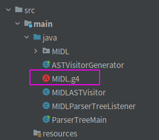

**姓名：洪志峰**

**学号：2019302860**

# 编译原理实验一实验报告

目录：

[TOC]

## 项目说明

### 1. 项目结构

结构图：

这是一个 Java Gradle 项目，项目结构遵循 Intellij Idea 默认构建的 Gradle 结构。

依次介绍一下项目文件夹：

`.gradle` 和 `.idea` ： 两个隐藏文件夹，放置一些配置文件，不用管。

`ast_result`： 存放根据MIDL语法生成的抽象语法树的输出结果。

`build`： 项目构建文件夹，不用管。

`gradle`：gradle的配置文件夹，不用管。

`src`: 存放代码和测试用例,其中：

​	`src/main/java` 中存放MIDL的g4文件和生成的源码文件，以及构建用于从MIDL源代码到语法树的代码。

​	`src/main/test` 中存放词法测试代码和语法测试代码，以及相应的测试用例，使用Junit5来测试。

`build.gradle`：gradle的配置文件。

`gradlew` 和 `gradlew.bat`：自动生成的gradle脚本文件，不用管。

`setting.gradle`：gradle的一个配置文件，不用管。

`抽象语法树.docx`：抽象语法树的设计说明文件。

### 2. 项目使用说明

#### 2.1 项目构建

只需安装下载 gradle 后，用 Intellij Idea 打开并配置 gradle， 或者在命令行中直接用gradle工具进行项目的配置即可。

具体的下载和使用教程可以看官网： https://gradle.org/

#### 2.2 词法和语法测试

如图：

在 `src/test` 文件夹下，有用于进行词法测试的`LexerTest`代码和用于语法测试的`ParserTest`代码。项目构建完毕后，直接点击运行就可以一键测试所有语法和词法了。

若想要修改测试用例，则直接点进`src/test/resources/test_lexer`和`src/test/resources/test_parser`中，修改对应的测试用例文件即可。

#### 2.3 生成语法解析树和抽象语法树

如图：

运行`src/main/java/ASTVisitorGenerator`就可以生成AST（抽象语法树）了，对应的生成结果在`ast_resule`文件夹中，每个语法对应一个`*_SyntaxOut.txt`文件。

运行`src/main/java/ParserTreeMain`就可以生成语法解析树了。对应的生成结果在`parser_tree_resule`文件夹中，每个词法对应一个`*_SyntaxOut.txt`文件。

## 实验完成情况说明

### 1. G4文件定义MIDL

对应的词法和语法已经写在 `src/main/java/MIDL.g4`中，如下图：

### 2. 抽象语法树定义文件

如图，写在了`抽象语法树.docx`中

### 3. 从MIDL源代码到语法树的分析程序

#### 3.1 MIDL源代码

如图，`MIDL.g4`生成的代码放在了`src/main/java/MIDL`中：

#### 3.2 语法解析树的分析程序

语法解析树的分析程序相关的文件如下：

其中`parser_tree_result`存放生成的语法解析树，

`MIDLParserTreeListener`是一个继承了`MIDLBaseListener`的监听器，用于在遍历过程中构建解析树。

`ParserTreeMain`调用了`MIDLParserTreeListener`，通过指定特定的语法进行遍历，来生成该语法的语法解析树，详见代码。

#### 3.3 抽象语法树（AST）的分析程序

抽象语法树的分析程序相关的文件如下：

其中`ast_result`存放生成的语法解析树，

`MIDLASTVisitor`是一个继承了`MIDLBaseVisitor`的访问器，用于在遍历过程中构建AST。

`AstVisitorGenerator`调用了`MIDLASTVisitor`，通过指定特定的语法进行遍历，来生成该语法的AST，详见代码。

#### 3.4 测试方法描述

对词法和语法的测试通过`Junit 5`来完成，如图：

如图：

`LexerTest`：词法测试代码

`ParserTest`：语法测试代码

测试思路：

如图：

先定义一个语法错误监听器，当有语法错误时会抛出异常。

然后书写`Junit5`测试方法，对相应的语法进行遍历，预期正确的语法不会抛出任何异常，故若语法正确则测试可以正常运行到结束，如下图是一个对`literal`语法进行测试的代码：

全部语法都没抛出异常则测试通过。

而对于预期为错误的语法，我使用`Junit5` 的`Assertions.assertThrows`方法来断言抛出语法错误异常，语法错误则断言正确，如下图：

全部断言正确则代表所有不合法的语法都不会被误识别。

这样，跑完所有测试用例后程序不异常，则测试通过，语法定义认为是正确的。

而对于抽象语法树构建的测试，我的方法是提供一些具体语法，然后通过``AstVisitorGenerator`生成对应的AST到`ast_result`中，然后将其与`抽象语法树.docx`中自己设计的语法树对比，两者一致则认为我生成的AST为正确。

如下图，这是对于表达式 `1 + 2*3/4`生成的抽象语法树：

可以发现它与`抽象语法树.docx`中的`add_expr`的定义一致。

故可以认为生成的AST是正确的。